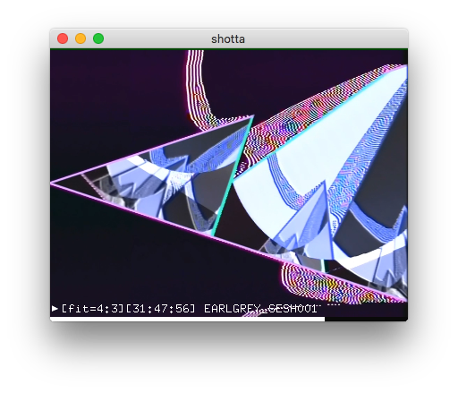

# Shotta

A quick [OpenFrameworks](https://openframeworks.cc/) app for grabbing screenshots from a video to Desktop. On MacOS it uses as fork of [ofxHAPAVPlayer](https://github.com/autr/ofxHAPAVPlayer) for fast timeline navigation, and on other platforms will revert to ofVideoPlayer.

## Download

There is a compiled release for macOS in the right-hand panel of this repo. For other platforms, it will need to be re-compiled via OF.

## Getting Started

Press `h` to show full help. There are two main modes - `CROP` and `RESIZE` - which use the ratio of the window but without downscaling the screenshot. The output screenshot will always be scaled to the longest size of the ratio (ie. no lossiness).
